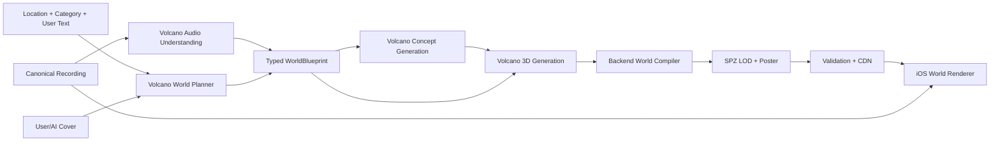

# Soundscape：Backend-Only Volcengine AI World Architecture

**研究日期：** 2026-07-21  
**状态：** Revised after product-owner constraints  
**Canonical constraints：**

1. 所有 AI 能力由 Soundscape backend 统一提供；客户端不得调用、配置或识别任何 AI provider/model。
2. AI provider 统一为 Volcengine / Volcano Ark，由 backend 的 canonical model registry 选择模型。
3. 永远不引入 ARKit、LiDAR、photogrammetry capture、multi-view capture 或现场 reconstruction flow。
4. 所有 immersive worlds 都是 AI-generated worlds，不声称还原真实地点几何。
5. iOS 只消费 typed world manifest 和资产；生成、重试、provider fallback、格式转换全部属于 backend。

## Executive Summary

可以实现，但正确架构不是 `iPhone capture → reconstruction`，而是：

```text
Soundscape audio + location + metadata + cover
  → backend Volcano audio/text understanding
  → typed WorldBlueprint
  → Volcano visual / 3D generation
  → backend world compiler
  → SPZ Gaussian world
  → CDN
  → iOS renderer + canonical recording
```

Volcano Ark 在 2026 年已经提供音频理解、Seedream 图像生成、Seedance 视频生成，以及正式的异步 3D 生成 API。Seed3D 1.0/2.0 和影眸 API 都具有 create/query task contract，因此可以被纳入现有 `volcano.py` adapter，而不是让客户端接触第三方 API。[citation:豆包语音模型](https://www.volcengine.com/docs/82379/1592918) [citation:Seedream API](https://www.volcengine.com/docs/82379/1541523) [citation:Seedance API](https://www.volcengine.com/docs/82379/1520757) [citation:Seed3D 2.0 API](https://www.volcengine.com/docs/82379/2271050) [citation:影眸 API](https://www.volcengine.com/docs/82379/1824743)

但必须保留一个技术事实：Volcengine 3D generation 当前首先是 **3D asset / scene generation** contract，不能在没有真实 account probe 的情况下假定直接返回移动端 SPZ。Backend 需要一个 deterministic world compiler，把生成结果转换、组合、验证并发布为 iOS 能消费的 SPZ。无法生成合格 SPZ 时，world job 必须失败，不得发布其他 3D 格式。

## 1. Product Semantics

Soundscape 只有一种 immersive provenance：

```text
kind = ai_generated_world
```

推荐 UI 表达：

- `AI 声景世界`
- `由地点、录音与封面生成`
- `AI GENERATED · SOUNDSCAPE`

禁止表达：

- `真实还原`
- `现场重建`
- `扫描空间`
- `digital twin`
- `3DGS reconstruction`

地点与录音用于控制世界的文化语义、声音密度、色彩、空间尺度与情绪，不是 geometry ground truth。

## 2. One Backend AI Boundary

现有 backend 已经有正确的起点：

```text
routers.ai
  → volcano.gen_text
  → volcano.gen_image
  → settings.py /config/llm.yaml model registry
```

世界生成必须扩展同一条边界，不能建立第二套 provider client：

```python
class VolcengineAI:
    def analyze_audio(...): ...
    def plan_world(...): ...
    def generate_concept(...): ...
    def generate_video(...): ...
    def create_3d_task(...): ...
    def query_3d_task(...): ...
```

Model IDs 只存在于 `/config/llm.yaml`：

```yaml
provider:
  name: volcengine
  base_url: https://ark.cn-beijing.volces.com/api/v3

models:
  default: <text-model-endpoint>
  audio_understanding: <audio-model-endpoint>
  image: <seedream-endpoint>
  video: <seedance-endpoint>
  world_3d: <seed3d-or-yingmou-endpoint>
```

客户端 contract 中不得出现：

- Volcano endpoint IDs；
- Seedream/Seedance/Seed3D model IDs；
- Ark API keys；
- provider-specific task status；
- provider response URLs。

## 3. AI World Generation Pipeline



### 3.1 Audio understanding

Backend 将 canonical recording 发给 Volcano audio-capable model，得到 typed JSON，而不是让模型直接写最终 prompt：

```json
{
  "schema_version": 1,
  "events": ["street vendors", "dense conversation", "metal shutters"],
  "acoustic_space": "narrow_outdoor_lane",
  "activity_density": 0.82,
  "motion_pattern": "pedestrian_flow",
  "mood": ["warm", "busy", "nostalgic"],
  "dominant_materials_inferred": ["metal", "hard_pavement"],
  "uncertainties": ["architecture", "weather", "time_of_day"]
}
```

`dominant_materials_inferred` 只能表示声学暗示，不得被当成地点事实。

火山方舟官方支持在 messages 中提交 audio content，并提供音频理解、事件识别与语音相关模型能力。[citation:豆包语音模型](https://www.volcengine.com/docs/82379/1592918)

### 3.2 WorldBlueprint

`WorldBlueprint` 是整个系统唯一的生成事实源：

```json
{
  "schema_version": 1,
  "soundscape_id": 15,
  "world_kind": "ai_generated_world",
  "verified_context": {
    "location_label": "香港 · 龙华巷",
    "place_types": ["market_lane"],
    "category": "地方"
  },
  "audio_semantics": {
    "events": ["vendors", "conversation"],
    "activity_density": 0.82,
    "mood": ["busy", "nostalgic"]
  },
  "visual_direction": {
    "style": "memory_realism",
    "palette": ["warm_amber", "humid_green"],
    "spatial_form": "walkable_narrow_lane",
    "landmark_policy": "no_unverified_landmarks",
    "text_policy": "no_readable_generated_signage"
  },
  "navigation": {
    "mode": "bounded_walk",
    "target_radius_m": 8,
    "initial_view": "forward"
  },
  "provenance": {
    "ai_generated": true,
    "source_modalities": ["audio", "location", "cover", "text"]
  }
}
```

所有 provider prompt 都由 backend compiler 从这个 blueprint 生成。不得在 routers、workers 和 iOS 中复制 prompt facts。

### 3.3 Visual generation

推荐使用 Volcano 的分层生成：

1. **Seedream**：生成 world concept、材质参考、天空/环境 visual anchor；
2. **Seed3D 2.0 或影眸 API**：生成完整或模块化 3D assets；
3. **Seedance（可选实验）**：生成固定轨迹 walkthrough，作为 scene consistency reference，不作为 canonical asset；
4. **Backend compositor**：按 blueprint 组合 scene、调整比例、建立 navigation bounds；
5. **World compiler**：输出 SPZ/poster/manifest。

Seed3D 2.0 官方介绍强调从单图生成 simulation-ready 3D asset，包括 mesh、PBR texture、material 与 semantics；这比直接要求模型返回 3DGS 更符合其官方能力边界。[citation:Seed3D 2.0](https://seed.bytedance.com/zh/seed3d_2_0)

影眸 API 提供异步 3D task create/query/delete 接口，可作为另一个 backend-only 3D provider endpoint，但实际输出格式、scene scale 和 commercial account quota 必须用当前 Ark account 做 preflight 后才能选为 production default。[citation:创建3D生成任务](https://www.volcengine.com/docs/82379/1824748) [citation:查询3D生成任务](https://www.volcengine.com/docs/82379/1824750)

## 4. How to Produce a Gaussian World

### 4.1 Recommended: mesh-first, SPZ-compiled

最稳定的路线不是要求 Volcano 原生返回 `.spz`，而是：

```text
Volcano-generated mesh/PBR scene
  → normalize coordinates and scale
  → sample textured surfaces into Gaussian surfels
  → assign position / rotation / anisotropic scale / opacity / RGB
  → optional backend optimization pass
  → encode SPZ
```

这仍然是 Gaussian-rendered world，但不是 photogrammetric radiance field。它的 geometry 和 textures 来自 AI-generated mesh，因此产品语义仍然是 AI-generated world。

Niantic SPZ 是 MIT-licensed compressed Gaussian format，官方称通常比对应 PLY 小约 10 倍，并定义 coordinate-system conversion 和 safe-orbit extensions，适合 backend compiler 的最终输出。[citation:Niantic SPZ](https://github.com/nianticlabs/spz)

### 4.2 Experimental: Seedance video → classical optimization

实验路线：

```text
WorldBlueprint
  → Seedance fixed-camera-path video
  → frame extraction
  → classical SfM / camera solve
  → Gaussian optimization
  → SPZ
```

这里所有生成式 AI 仍然来自 Volcano；后续 camera solve 和 Gaussian fitting 是 deterministic reconstruction/optimization tooling，不是另一家 AI provider。

风险很高：生成视频可能在遮挡、纹理、物体数量和几何上逐帧漂移，导致 SfM 或 Gaussian optimization 失败。因此它只能是 experiment，不能是 P0 production path。

### 4.3 SPZ admission gate

SPZ 是唯一 world asset contract。Backend compiler 必须拒绝以下结果：

- 无法转换为合法 SPZ；
- Gaussian count、bounds 或 coordinate system 不合法；
- preview/standard LOD 缺失；
- asset checksum 不匹配；
- safe navigation bounds 无法建立；
- validation render 出现不可接受的空洞或漂浮噪点。

拒绝结果进入 `failed_retryable` 或 `failed_terminal`。客户端回到录音与封面，不允许发布另一种 3D 格式。

## 5. Backend World Job Contract

世界生成必须异步，不能阻塞 `POST /soundscapes`：

```http
POST /soundscapes/{soundscape_id}/world-jobs
GET  /world-jobs/{job_id}
POST /world-jobs/{job_id}/retry
GET  /soundscapes/{soundscape_id}/world
DELETE /soundscapes/{soundscape_id}/world
```

### Canonical manifest

```json
{
  "schema_version": 1,
  "soundscape_id": 15,
  "kind": "ai_generated_world",
  "status": "ready",
  "generation_version": "soundscape-world-v1",
  "assets": {
    "spz_preview_url": "/soundscape/worlds/15/world-preview.spz",
    "spz_standard_url": "/soundscape/worlds/15/world-standard.spz",
    "poster_url": "/soundscape/worlds/15/poster.webp"
  },
  "render": {
    "coordinate_system": "RUB",
    "meters_per_unit": 1.0,
    "initial_camera": [0, 1.6, 0, 0, 0, 0, 1],
    "safe_bounds": {
      "min": [-8, 0, -8],
      "max": [8, 5, 8]
    }
  },
  "provenance": {
    "ai_generated": true,
    "label": "由地点、录音与封面生成的 AI 声景世界"
  },
  "failure": null,
  "updated_at": "2026-07-21T08:00:00Z"
}
```

Provider/model/task IDs 只保存在 private job audit table，不能成为 public/client contract。

### State machine

```text
queued
 → analyzing_audio
 → planning_world
 → generating_concept
 → generating_3d
 → compiling_world
 → validating_assets
 → ready

任何阶段 → failed_retryable | failed_terminal | cancelled
```

## 6. iOS Responsibilities

iOS 只负责：

- 请求 `GET /soundscapes/{id}/world`；
- 按 typed status 显示 generating/ready/failed；
- 下载 preview asset；
- checksum 与 manifest validation；
- 渲染 SPZ；
- 同时播放 canonical recording；
- 缓存 world assets；
- 根据 thermal/memory/frame-time 降级 preview/standard；
- 永久显示 AI provenance。

iOS 永远不负责：

- 选择 Volcano model；
- 生成 prompt；
- 上传音频到 Volcano；
- provider polling；
- 3D asset conversion；
- Gaussian fitting；
- provider retry/fallback；
- 任何 ARKit 或 capture flow。

MetalSplatter 是 MIT-licensed Swift/Metal renderer，支持 iOS、macOS 和 visionOS，并能读取 SPZ，适合 Soundscape 的单一 world asset path。[citation:MetalSplatter](https://github.com/scier/MetalSplatter)

## 7. Backend Module Shape

建议新增独立 world context，而不是继续扩大 `routers/ai.py`：

```text
soundscape-backend/
  worlds/
    domain/
      contracts.py
      state.py
    application/
      create_world_job.py
      advance_world_job.py
      retry_world_job.py
    infrastructure/
      volcengine_ai.py
      world_compiler.py
      spz_encoder.py
      asset_store.py
      job_repository.py
    router.py
    worker.py
```

Dependency direction：

```text
router/worker → application → domain contracts
infrastructure → domain contracts
domain → nothing framework/provider-specific
```

现有 `volcano.py` 可以先演进为 adapter，但 production implementation 不应继续把 text、image、audio、video、3D request functions 平铺在一个无类型工具文件里。

## 8. Model Registry

`/config/llm.yaml` 是唯一 model source of truth。建议增加 capability-based registry：

```yaml
models:
  default: doubao-seed-2-0-pro-260215
  image: doubao-seedream-4-0-250828
  audio_understanding: <activated-endpoint-id>
  video: <activated-seedance-endpoint-id>
  world_3d: <activated-seed3d-or-yingmou-endpoint-id>

world_pipeline:
  version: soundscape-world-v1
  primary_asset: spz
  preview_gaussians: 100000
  standard_gaussians: 500000
```

这些值必须来自 account preflight，不得根据文档中的 public model name 猜测 endpoint ID。

## 9. Required Preflight

在写 production implementation 前，使用 backend service identity 对当前 Volcano account 做只读/最小成本 preflight：

1. 确认 audio understanding endpoint 已激活；
2. 确认 Seedream image endpoint；
3. 确认 Seedance endpoint 是否需要；
4. 确认 Seed3D 2.0 或影眸 endpoint 已激活；
5. 提交一个最小 3D task；
6. 记录真实 create/query response schema；
7. 下载真实 output，确认可被 backend compiler 转换为 SPZ；
8. 确认 texture、material、scene scale、license、retention、quota；
9. 本地做一次 mesh→SPZ conversion；
10. 在 ZLIPHONE 测 preview 与 standard SPZ。

没有第 6–7 步证据之前，不能把任何 guessed Volcano response schema 写进 public contract。

## 10. Recommended MVP

### Phase 0 — Volcano capability spike

选三条 Soundscape：

- 地方：龙华巷；
- 建筑：室内/街区建筑声景；
- 自然：公园或海边。

每条执行：

```text
audio analysis
 → WorldBlueprint
 → Seedream concept
 → Seed3D/影眸 task
 → download real asset
 → backend compile SPZ
 → render on ZLIPHONE
 → play original recording
```

通过标准：

- 三个世界可被用户仅凭视觉正确区分为地方/建筑/自然；
- world mood 与录音事件一致；
- 不出现未经验证的著名地标、可读假招牌或人物身份；
- preview world 在目标设备稳定交互；
- world generation 失败不影响录音发布与播放；
- 删除 soundscape 会级联删除 world job、source derivatives 与所有 assets。

### Phase 1 — production backend

- typed WorldBlueprint；
- async job DB + worker；
- Volcengine adapter；
- private provider audit；
- world compiler；
- SPZ validation；
- retry/idempotency/timeout；
- public world manifest；
- CDN/cache/delete cascade；
- contract tests and failure-state tests。

### Phase 2 — iOS renderer

- `WorldRepository` typed contract；
- asset cache；
- MetalSplatter SPZ renderer；
- loading/generating/failed/ready UX；
- thermal/memory LOD；
- physical-device performance suite。

## 11. Final Recommendation

不要再投入当前 deterministic particle scene。它既不消费 backend world contract，也无法表达录音或地点语义。

正确的下一步不是接入 Marble、Qwen、VGGT 或 ARKit，而是先完成一个 **backend-only Volcano capability spike**：

```text
existing Volcano backend boundary
 + audio understanding
 + WorldBlueprint
 + Seedream
 + Seed3D/影眸
 + mesh-to-SPZ world compiler
 + MetalSplatter
```

如果 Volcano 的 3D endpoint 不能被稳定编译成合格 SPZ，则该 capability 不进入 production。Soundscape 不发布另一种 3D 格式，也不恢复 procedural particle world；客户端继续提供录音、封面和明确的 world generation failure state。

## Sources

1. [citation:豆包语音模型](https://www.volcengine.com/docs/82379/1592918) — Volcano Ark audio input and audio-capable model documentation。
2. [citation:Seedream API](https://www.volcengine.com/docs/82379/1541523) — Volcano image generation API。
3. [citation:Seedance API](https://www.volcengine.com/docs/82379/1520757) — Volcano video generation API。
4. [citation:Seed3D 1.0 API](https://www.volcengine.com/docs/82379/2124930) — Volcano asynchronous 3D task API。
5. [citation:Seed3D 2.0 API](https://www.volcengine.com/docs/82379/2271050) — current Seed3D 2.0 task API。
6. [citation:Seed3D 2.0](https://seed.bytedance.com/zh/seed3d_2_0) — official model capabilities and simulation-ready asset description。
7. [citation:影眸 API](https://www.volcengine.com/docs/82379/1824743) — Volcano 3D generation API overview。
8. [citation:创建3D生成任务](https://www.volcengine.com/docs/82379/1824748) — Yingmou task creation。
9. [citation:查询3D生成任务](https://www.volcengine.com/docs/82379/1824750) — Yingmou task status/result query。
10. [citation:Niantic SPZ](https://github.com/nianticlabs/spz) — compressed Gaussian asset format。
11. [citation:MetalSplatter](https://github.com/scier/MetalSplatter) — Apple-platform Gaussian renderer。

## Open Questions Requiring Account Evidence

- 当前 Ark account 激活的是 Seed3D 2.0、影眸，还是两者；
- 真实 output formats、download lifetime 与 asset size；
- 是否支持 scene-level generation，还是主要生成单个 asset；
- texture/PBR/semantic outputs 的实际 schema；
- world generation quota、并发、timeout 与计费；
- provider 对原始录音、位置和生成资产的 retention policy；
- mesh→SPZ 后在 ZLIPHONE 上的视觉质量与 frame time。
